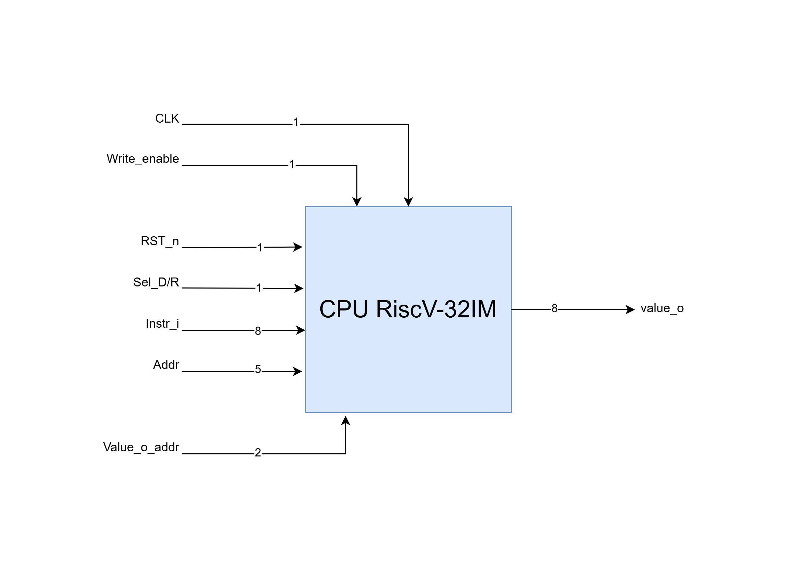

# RISCV_RV32IM_CPU
* This is a RISC-V-RV32IM CPU(32 bit), support 5-stage pipelined, Hazard detection, Fowarding and basic instructions.
* System Clock up to 55 MHz (Depended on LUTs technology of FPGA Arty z7).
* The simulation, synthesised and implementation was done by Xilinx Vivado.

# Block Diagram
>

# Instruction Types
>
>
>
> Basic Instructions Supported:
> * and
> * or
> * add
> * sub
> * mul
> * addi
> * lw
> * sw
> * beq

# I/O Port Configuration
>
> * Input Ports:
>   * CLK: System Clock.
>   * Write_enable: Enable saving of an value 8 bit instruction on the positive edge.
>   * RST_n: Reset system, Active low.
>   * Sel_D/R: If = 0, output value saved in DataMemory, else output value saved in register.
>   * Instr_i: Reads 8-bit instructions at a time on the positive edge of the Write_enable signal. It takes 4 positive edges of the Write_enable signal to read one instruction.
>   * Addr: Address that you want to access, this input is 5-bit since size of both DataMemory and Register are 32.
>   * Value_o_addr: The value saved in the memories are 32-bit, but our CPU can only ouput 8-bit at a time. Thus, we need to decide which 8-bit are to be read. For example, if value_o_addr = 0, the CPU will output the most signficant 8-bit in the address we assigned.
> * Output Ports:
>   * value_o : Output value.